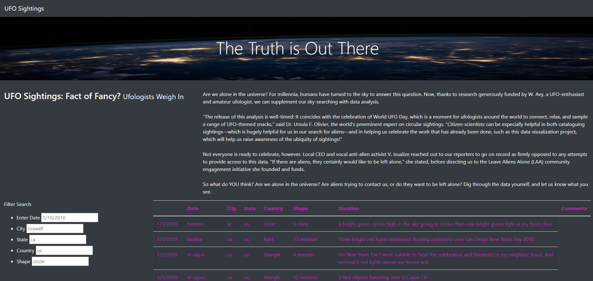

# UFO overview analysis
    This module challenge is to create a webpage and dynamic table and to provide a more in-depth analysis of UFO sightings by allowing users to filter for multiple criteria at the same time
            -date
            -city
            -state
            -country
            -shape
## Summary
    One drawback of this new design is that there is no button to initiate the filter commandand two recommendations for further development is to add the button and create more distinct color changes in the filter table its self as shown below:
    

